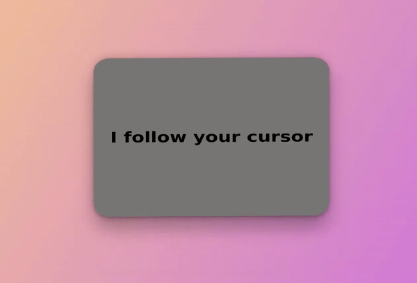
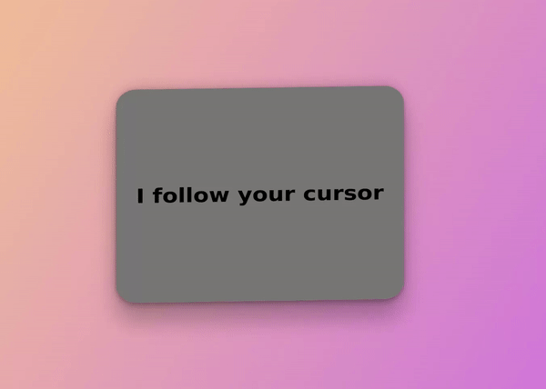

# 3 Dimensional Card Facing the Cursor
I really enjoy creating animations and bringing 3D elements into the web as well as reverse engineering things I find interesting just because I want to know if I can!

During my studies, I came across this awesome 3d card effect that changes its rotation based on mouse move inside the document (all credit goes to [Poppr](https://www.poppr.be/)): 

</br>
<div align="center">
  
  <p>Let's be honest, they nailed it with this, awesome job!</p>
</div>
</br>

Needless to say, I tried to emulate the same effect with plain HTML, CSS & JS... WITH GREAT SUCCESS!

## Table of Contents
- [The Code](#the-code)


## The Code
Nothing fancy for the HTML. You just need a div.

```html
<div class="card">
  <h1 class="title">I follow your cursor</h1>
</div>
```

Also nothing fancy for the CSS. Some styles for the body, to center the card on the screen, and some styles for the card itself. Other than that, everything else is optional!
```css
*,
*::before,
*::after {
  box-sizing: border-box;
  margin: 0;
  padding: 0;
}

html {
  font-size: 62.5%;
}

body {
  font-family: sans-serif;
  min-height: 100vh;
  display: grid;
  place-items: center;
  background-image: linear-gradient(120deg, #fccb90 0%, #d57eeb 100%);
}

.card {
  display: grid;
  place-items: center;
  text-align: center;
  background: #777;
  font-size: 2.8rem;
  padding: 0 5rem;
  min-height: 60rem;
  border-radius: 5rem;
  
  box-shadow: rgba(0, 0, 0, 0.25) 0px 54px 55px, rgba(0, 0, 0, 0.12) 0px -12px 30px, rgba(0, 0, 0, 0.12) 0px 4px 6px, rgba(0, 0, 0, 0.17) 0px 12px 13px, rgba(0, 0, 0, 0.09) 0px -3px 5px;
}
```

Inside our JavaScript file is where the magic happens... we need a reference to the `document` to listen for `mousemove` events and a reference to the card itself to change it's rotation whenever the mouse, well, "moves".

```js
const card = document.querySelector('.card');

document.body.addEventListener('mousemove', ({ pageX, pageY }) => {});
```

With this we are able to do 50% of the work needing done. Now, we need to retrieve the X and Y coordinates of the cursor and change the card's rotation with it.
```js
{
  const middlePageX = window.innerWidth / 2;
  const middlePageY = window.innerHeight / 2;

  const coordX = ((pageX - middlePageX) / middlePageX) * 45;
  const coordY = (((pageY - middlePageY) / middlePageY) * 45) * -1;
}
```

With this math I retrieve the offsetY & offsetX of the cursor, then divide it by the middle values to turn them both into percentages values and then, finally, multiply them by 45. Which was the maximum value in degrees I wanted the rotation to get **(experiment with this value as you wish)**.

Inside the `coordY` constant, I multiply again by -1. This is needed to fix this rotation issue with the Y axis on animate:

</br>
<div align="center">
  
  <p>X axis works well but Y axis is always reversed!</p>
</div>
</br>

Finally, to animate the card I leveraged the `.animate()` [method](https://developer.mozilla.org/en-US/docs/Web/API/Element/animate) from the [WebAnimationsAPI](https://developer.mozilla.org/en-US/docs/Web/API/Web_Animations_API). It creates a new `Animation` interface, applies it to the element and then executes it.

```js
card.animate({
  transform: `rotateX(${coordY}deg) rotateY(${coordX}deg)`,
}, { fill: "forwards" });
```

With this I basically say: create a new `@Keyframes` animation inside this element, give it that value and make the `animation-fill-mode` retain the last value found during execution (the last position of your cursor, in this case). 

### Pro Tip
Whenever we want to animate things in a 3D fashion with CSS, always set your rotateX value to the value in **Y Axis** and rotateY to the value in the **X Axis**. You do this because logically you'll want your Y position to be seen by the x axis and vice versa. Didn't understand? Change the values to this and you'll get the idea:
```js
transform: `rotateX(${coordX}deg) rotateY(${coordY}deg)`
```

And that is it! This is the final result:
</br>
<div align="center">
  
  <p>Awesome</p>
</div>
</br>

## Final Thoughts
Thank you for reading this far! If you enjoyed this, please leave a star and share this repo! If you want to know more about the WebAnimationsAPI, these may help you:
- [WebAnimationsAPI](https://developer.mozilla.org/en-US/docs/Web/API/Web_Animations_API)
- [Using the WebAnimationsAPI](https://developer.mozilla.org/en-US/docs/Web/API/Web_Animations_API/Using_the_Web_Animations_API)

And that's about it! Have a great rest of your day!
